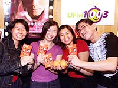

年轻声音吵醒广播天空
---------------------

　　作者：赵琬仪 摄影：李白娟 来源：新加坡《联合早报》

　　他们的笑声震耳欲聋？他们在空中有话敢敢说，一些听众不能接受。

　　义安理工学院一群大众传播系学生在UFM1003当兼职DJ。开台4个月后，记者验收他们的成绩。

　　年轻人玩得起，也有一本正经的一面。

　　当电台DJ是许多年轻人的梦，憧憬榜上排名仅次于演艺圈、时尚圈。

　　报业传讯与职总媒体合作社合资公司联盟传讯（Union Works）的华语电台UFM1003去年开台之前，特别到设有大众传播系的义安理工学院招募兼职电台主持人。学生反应热烈，结果逾100名的应召者当中，有10人入选。

　　根据每个人的个性和喜好，这10人分别被编入5人一组“有话敢敢说”的U计划（U Plan），以及负责优势流行榜的U托帮。

　　U计划在节目上互相“烧烤”，展开劲爆话题，险逼三级边界，遭听众传真抗议。U托帮笑声阵阵的热闹风格则引起有人喜欢有人不的争议。

　　4个月走过来，这群年轻人挨人骂也得人赞，成长了不少。

　　一个星期天的下午，记者见识了这群学生兼职DJ的七嘴八舌。

　　目前主持星期六晚上点歌节目的“天使”郑如君说：“原来当DJ不是每个月拿薪水开唛讲话这么简单。本地的广播空间很小，叫人呼吸困难。”

　　麦克风前开不了口

　　当一名称职的DJ有多不简单？我们先从个人问题讲起吧。

　　U托帮成员许安妮刚开始主持节目，便马上联想到学校讲师的一话。“每个人都会说话，不过不是每个人都可以把话说好。”

　　如何在麦克风前把话说好，并把自己的意思准确无误、完整无缺地表达出来，是所有广播新人必须克服的第一道难题。

　　自认没有其他四个U托帮成员活泼的安妮，一开唛就会紧张到说话结巴。即使个性开朗自信的吴诗涵，也面对开唛后因为怕讲错话，而影响表达能力的问题。看来在麦克风前“开不了口”是很多新人的通病。

　　年轻人的另类表达方式

　　即使能够在唛前畅所欲言，也不表示说话可以不加思索，有话可以直说。寿命只有短短两个月半的U计划，节目构想原是要反映时下年轻人的想法。U计划曾经讨论过的话题包括男女平等、异族通婚、阿富汗课题等。李文说：“年轻人不是没有自己的想法。不过我们的表达方式不是所有人都能接受。”

　　U计划曾经接到听众传真，指责他们不应该在节目上谈论性器官。郑如君说：“敏感的字眼，我们都没有说出口，只是在beat around the bush（拐弯抹角地谈论）。”

　　如果说生活中的语言在踏入广播门槛之前都要经过漂洗、规范，内容都要符合一定模式，那么广播如何反映真实生活，怎么展现生活的多姿多彩、无奇不有？这个问题资深广播员也未必能完美解答，更何况是这群不过有数月兼职经验的年轻人。

　　七嘴八舌也讲默契

　　怎么把话说好是个人控制得来的，那么和合作伙伴的主持默契、听众的反应，则不是个人控制得来的，也是主持节目考功夫的地方。

　　U托帮5人虽然同校，在一起主持节目之前，5人不过是点头之交。要5个不熟络的人坐在直播室里高谈阔论，还要和广播经验丰富的杨君伟同台演出，说自己没有压力，是骗人的。

　　就有听众说这5片绿叶，衬不起牡丹杨君伟。安妮的想法是：“听众不应该拿我们和君伟比较。我们刚开始主持节目，经验尚浅。”

　　人多自然口杂，对一些又要收听节目又要耳根清静的听众来说，U托帮的震耳笑声在星期天中午还是刺耳的。

　　谢家发说：“听众不会愿意听一个比自己更闷的人说话，所以我们尽量表现得轻松热闹。广播其实是服务行业。DJ心情不好，也不可以把情绪带进节目，要照顾到听众的‘听觉享受’。”

　　面对批评，U托帮发挥了年轻人输得起的本色。

　　郑宛欣说：“听众批评我们吵，我觉得是他们不能接受我们。”

　　苏于玲非常坦然：“既然要做节目，就要接受批评。我是做好心理准备的了。”

　　笑也要讲姿势

　　被听众投诉之后，君伟特别指点U托帮正确的“笑的姿势”——笑的时候要仰后，离麦克风远一点。而U托帮也知道光靠笑声无法撑足全场，所以也多加尝试，丰富节目内容，例如做音乐比较、交换娱乐资讯、音乐趋势等。

　　不过，家发的经验是即使事前做了准备，做节目时不一定派得上用场。“5个人开始时不熟，不大懂得彼此接话。事前做了充分的准备，也未必能在节目中发挥出来。”

　　经过了4个月的相处，5人现在已成为相约一起吃饭看电影的好朋友。现在的问题是，默契太好了，抛出一个笑话，大家会笑到不会收声……学习自制，那是主持节目的另一门功课。

　　然而，U托帮有3名成员今年5月将毕业，到时U托帮的阵容会不会有变动，则有待电台高层决定了。

　　幕后制作挑战大

　　听过UFM由黄文鸿和新人“小猪”主持的早晨节目“大家来找碴”的听众，对“阿哲”、“阿保”这两个名字必定不会陌生。

　　在众多学生兼职DJ当中，年纪最轻的阿哲原是U计划成员，U计划结束后，他加入幕后制作的工作，例如录制节目jingle(广告短词或短歌)、每星期四推出“电影大搜查”影评单元。

　　另外，他和阿保还为早班节目制作街头访问。他完成过最惊险的任务是直闯红灯区（全程叫他毛骨耸然直发抖），最难忘的任务是星期天访问乌节路的菲佣（开始访问时差点因为怯场而临阵逃脱，硬着头皮采访后，则为新加坡人的丑陋行为，替菲佣感到难过）。

　　如果说拍电影是阿哲的“最爱”，那么做广播则是他的第二个最爱。有一段日子，他几乎每日都到UFM电台报到。

　　长着一张孩子脸的阿哲，思想一点也不孩子气，说起话来十分有见地：“UFM是一个新台，新人就更有机会学习和发挥。自由的创意空间正是创作狂热分子梦寐以求的。广播的魅力在于，只需要运用声音就能使一个人会心微笑、转换心情。”

　　阿保加入UFM的经过非常曲折。他应征U计划失败后心有不甘，一再致电给UFM节目总监黄文鸿，请求电台给他学习的机会。当时阿保读了一篇有关一对美国孪生兄弟发迹的报道，使他觉悟到自己的前途一定要靠自己争取。

　　冲着他对广播的兴趣，他厚着脸皮向电台毛遂自荐，结果真的让他如愿以偿。即使是没有酬劳，他也无所谓。

　　加入UFM后，他从掌控控盘开始学起，学会后就帮新人控盘，接着是负责剪辑大小节目制作、采访新闻。3月起，他正式成为UFM职员，负责节目制作和宣传行销。记者打趣道：“守得云开见月明。”

　　抗拒曝光却又踏入半个娱乐圈的阿保说：“年轻人喜欢广播，可能是出于虚荣心，认为它很炫。广播吸引我，是因为它真的很好玩，可以学到很多东西。”

　　能够让年轻人把学习当作乐趣，广播的魅力自是不容质疑的，即使在空间有限的新加坡。

