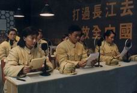
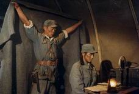

《声震长空》剧情介绍
---------------------

　　来源：新影联

　　相关链接：创建延安新华广播电台的回顾

　　一九四零年，党中央决定在王皮湾筹建延安新华广播电台，屡建战功但身患疾病的苏志豪担任电台队长，他带领战士们及当地的老乡凿石、开洞、安装设备。

　　刚从鲁艺毕业的殷佳茹、郑之钰奉命到电台报到当播音员。殷佳期惯讲上海话，播音时心慌憋不住尿，受到队长苏志豪的批评。郑之钰不安心在电台当播音员，想上前线为亲人报仇，就给上级写信，受到指导员关祥瑞的批评。

　　电台试播时，动力系统出现问题，队长苏志豪迅速排除故障。经过紧张、坚苦的准备，一九四零年十二月三十日，延安新华广播电台试播成功，受到党中央、毛主席的表扬和鼓励。

　　皖南事变发生后，延安新华广播电台及时播出了党中央的声音，延安文艺界用各种文艺形式现场直播《黄河大合唱》表达了国破家亡的满腔愤怒……

　　一九四六年，蒋介石发动全面内战，党中央决定在瓦窑堡建立备用广播电台，殷佳茹等一部分战士在转移瓦窑堡途中，敌机开始轰炸王皮湾，殷佳茹又返回王皮湾协助苏志豪播音。敌机滥炸、炮火连天，二人不顾生命危险，继续播出党中央的指示，炸弹炸塌了播音室，苏志豪负伤。

　　胡宗南占领延安后，党中央决定在晋冀鲁豫建立二、三线广播电台。殷佳茹、郑之任等战士在指导员关祥瑞的带领下，奔赴晋冀鲁豫创建新的广播电台。苏志豪仍然坚持留在陕北新华广播电台工作。

　　一九四九年三月，苏志豪与九分队全体战友在北平重逢，北平新华广播电台开始播音。殷佳茹与苏志豪结为伴侣。人民解放军解放南京时，北平新华广播电台奉命向南京国民党广播电台喊话，命令南京国民党电台转播北平新华广播电台的节目。但苏志豪终因积劳成疾为中国人民广播事业献出了生命。根据苏志豪的遗愿，把他安葬在延安清凉山上。

　　一九四九年十月一日，新中国成立那天，延安的老乡们手捧各色供果，从四面八方拥向苏志豪安息的清凉山，赵老汉的矿石收音机传出毛主席的声音，震撼了祖国山川大地……

　　中国人民广播事业走过了光辉的历程，今天已经发展成覆盖城市和乡村的网络。她的第一声，是一九四零年冬天，在延安，人们用生命奏响的。

　　该片反映了人民广播事业在中国革命历史上所发挥的重大作用，浓缩了人民广播事业创建、发展、壮大的光辉历程，表现了一代青年投身革命后不畏艰难、勇于奉献的革命斗志和高尚的敬业精神，歌颂了老一代广播人在战争年代的艰苦奋斗和革命乐观主义精神。

　　《声震长空》是第一次将延安新华广播电台搬上银幕的影片，该片以中国共产党领导的第一座广播电台——延安新华广播电台的创建过程和发展历程为经，以中国革命不同时期的重大历史事件为纬，全面、准确地反映了党的新闻喉舌——人民广播的创立和其初期发展演变的轨迹。影片描写了人民广播在不同革命历史阶段发挥的重要作用，歌颂了老一辈广播战士崇高的思想情操和不怕苦、不怕牺牲的革命精神，填补了中国电影表现党的新闻工作的一个空白。

　　作为一部革命历史题材影片，《声震长空》不同于其他同类型影片，它没有将领袖人物推向前台，而是以广播电台的一群播音、技术和编辑人员等普通人的战斗和生活为主线。通过这些普通人的工作和生活，从而折射出中国革命不同时期发生的重大历史事件，以微见著。这种巧妙的构思方式，使政治性极强的革命历史题材影片更贴近观众。在人物命运的发展中，承载了一个关于人生价值的重大主题，从而使该片具有了深层次的人文思想。

　　《声震长空》成功塑造了广播电台的队长、播音员、技术员、编辑和陕北老乡等英雄人物。这个英雄群体从一九四零年筹建延安新华广播电台到12月30日开始播音、从上皮湾迁移到瓦窑堡、从瓦窑堡到晋冀鲁豫、从晋冀鲁豫到北平、一直到一九四九年开国大典，他们为中国革命事业做出了卓越的贡献。通过人民广播事业10年发展历程，反映了在皖南事变、抗战胜利、国民党发动内战、胡宗南进攻延安、北平解放、南京解放、开国大典这些重大事件中，人民广播发挥的重大作用。这两条主线互相交叉，紧密地结合在一起。

　　为了增强影片的声画效果和可看性，摄制组特意选择了陕北作为外景地。一座座山峰之间，活跃着一群执着的战士；蓝天白云下延安人民庆祝抗战胜利；炮火硝烟中，广播战士奋不顾身，忠于使命、坚守岗位；身姿翩政、声震山谷的安塞腰鼓；悠扬动听的陕北民歌……

　　影片着力营造出浓郁而鲜活的陕北风情和声画效果，真实的表现了延安新华广播电台播音的情景，使人感到既亲切又新鲜，使一部重大题材与重要主题共具的影片，摆脱了严肃与沉重，而呈现出一种生动活泼和浪漫色彩的氛围。该片观后，激动人心，给人一种震撼力，多处催人泪下。

