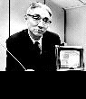

圣田昭夫 日本制造
-------------------

　　【作者：萧 骁】

　　■盛田昭夫

　　盛田昭夫1921年出生在名古屋的一个酿酒家族，毕业于大阪帝国大学。1946年，他同索尼公司的另一位创始人井深大合伙创立了东京通信工业公司，并在短短的几十年内将一个小厂发展成著名的国际性大企业。“二战”后，在日本经济非常艰难的情况下，发挥其天赋，创造了日本的几个第一：1950年，制造出了日本第一代磁带录音机和磁带；1954年，利用美国元件制造了日本第一台半导体收音机；1955年，生产出了第一台全部由日本自制的半导体收音机；1960年，索尼公司生产出世界第一台半导体电视机；1965年，生产了第一台家庭录

　　像机；1970年，索尼公司成为日本第一家在纽约股票交易所上市的公司；1972年，又成为日本第一家在美国建厂的公司；80年代，索尼公司开始出售Walkman随身听微型收录机。从此，“日本制造”便成为高品质电器的代名词。

　　盛田昭夫在1971年成为索尼公司总裁，并在1976年出任会长。他1993年底在打网球时中风后就不参加商业和社交活动。

　　■“索尼先生”盛田昭夫10月3日因肺炎病逝于东京

　　■最后一名战后崛起的日本企业巨人离世

　　■今年8月被选为本世纪最具影响力的亚洲人士之一

　　■发明“随身听”让人拥有抚慰心灵的新感官世界

　　10月3日，日本“索尼公司”创办人盛田昭夫在东京一家医院因患肺炎医治无效而去世，享年78岁。一个星期来，世界各地的媒体都在纷纷刊载这位发明了收音机、录音机、“随身听”等给人们带来无限快乐的发明家，提出现代公司经营理念，著有《日本人可以说“不”》等书的世界级超级老板一生的传奇。

　　幼时显露经商天赋

　　盛田昭夫出生在一个世代经商的家庭里，到他父亲这辈，家庭开设的日本清酒公司在名古屋已经是非常有名气了。耳闻目睹以及天赋使然，盛田昭夫小学三年级的时候就显露出经商的才能———为同学设计别致的小纸贴风行整个学校，最终成了同学们的抢手货，并且还得事先预订才行！

　　二战期间，为了躲避日本的兵役，盛田昭夫挂名到一家日本军队的研究所打杂。在那里，他认识了日后“索尼公司”的另一位创办人，并且成为共知共识的好朋友。盛田昭夫没有躺在父辈们创下的基业上睡大觉，他放弃了舒舒服服的阔少爷生活，而是创办了“东京电讯工程公司”。

　　创业之初惨淡经营的盛田昭夫确实拥有非凡的市场洞察力。盛田昭夫的公司一起步就提出了“品牌效应”和“品牌责任”两大全新的概念。这两种概念的核心就是：一提起品牌的名称就想到高质量的产品。这两大概念现在被日本公司广为使用，但在当时却是特别超前的，因为当时日本绝大多数的公司都是靠挂别人的招牌生产产品的，比如说“潘太克斯”是给美国的“霍尼威尔公司”加工产品；“理光”打的是“萨尔文公司”的招牌；“三洋”是为“希尔斯公司”打工。

　　赋予“日本制造”全新的意味

　　“索尼公司”的第一件产品是1955年生产出来的晶体管收音机。尽管晶体管是美国“贝尔实验室”第一个发明的，又是美国“西部电子公司”第一个生产出来的，但美国人看不出这玩意儿有多大的用途，所以根本就没有厂家问津，然而，盛田昭夫却以独到的眼光说服日本政府的科技部门，并且从父亲那里借来了在当时如同天文数字般的20000美元。直到盛田昭夫把晶体管技术买到手后，日本国内仍没有理解晶体管的意义，觉得盛田昭夫简直是他们家族的败家子！然而，当“索尼公司”1957年推出的便携式收音机风靡世界后，日本和美国的众商家们才恍然大悟，但市场已经被“索尼”占先了。继收音机之后，“索尼公司”先后推出了许多“第一”：第一台8英寸电视机、第一台录音机……“索尼”的技术和产品以及市场使“日本制造”的含义发生了根本性的变化：“日本制造”意味着好产品，好质量，好的服务，把“日本制造”的产品从廉价的形象飞跃到“高质量”的地位。

　　创造日本式市场经济的范本

　　实际上“索尼”这个名字就是盛田昭夫创造力和超前意识的最佳体现。当他考虑要为“东京电讯公司”重新起个名字的时候，他就想到重要的一点：起一个在任何地方任何时候都叫得响的公司名称。这个公司品牌名字必须看一眼、听一耳朵就能让人想到公司和品牌有创造力，简短、顺口但又绝对让人不容易忘记。两位创始人一连几天扎在图书馆里，他们最终发现了一个拉丁单词“SONUS”，这在拉丁文中是“声音”的意思，另一个单词“SONNY”又是美国年青人当时非常时髦的口头禅，盛田昭夫和他的合作伙伴大喜过望，把两个单词合起成“SONY”不正是意味着一个由年轻人组成的生机勃勃的公司么，就把它当成公司和品牌的名称吧！

　　“索尼”真正向全球化发展始于1963年盛田昭夫举家迁到美国之时。正因为这次举家搬迁，盛田昭夫才有机会了解美国人，了解美国人的市场，了解他们的消费习惯和各种规定。把公司的业务发展到海外，走向全球对于当时的日本商人来说确确实实需要勇气和非凡的超前意识。如果没有这种胆识的话，盛田昭夫是不可能成功，也就没有了今天的“索尼”。盛田昭夫把“索尼公司”的办公地点设在曼哈顿第五大街一套大大的公寓里。每个星期，他总要举办许多社交活动和晚会，从而为“索尼”公司建立一个稳定有价值的顾客网络。盛田昭夫后来一辈子都保留了这个习惯。

　　精力充沛的“超人”

　　五年前，日本“索尼公司”的董事长兼创始人之一的盛田昭夫在打网球的时候突然间跌倒在地上。中风后与轮椅为伴的生活对于从来没有静静坐下来休息哪怕是一会儿功夫的盛田昭夫来说确实苦不堪言。盛田昭夫的网球伙伴们都知道，每天早上7点钟，已经是72岁高龄的盛田昭夫总是准时地出现在网球场上。跟网球场上任何人都不同的是：别人玩一阵子总有累了坐下来休息的时候，可盛田昭夫就像一台有无穷马力的机器一样向场上的每一个人挑战，从来没有看见他有觉得累的时候。

　　盛田昭夫的精力究竟有多充沛呢？让我们看看他中风前两个月的行程安排就知道了：他从日本东京的“索尼”总部出发，马不停蹄地访问了美国的新泽西、华盛顿、芝加哥、达拉斯、洛杉矶、圣安东尼奥、英国、西班牙的巴塞罗那和法国的巴黎。访问期间，他逐一拜见了英国女王伊丽莎白二世、美国通用公司总裁杰克·威尔奇、未来的法国总统希拉克以及其他的政治家、官员和商界人士。他证了1次婚；欣赏了2场音乐会和1场电影；在日本国内进行了4次的视察；出席了8次招待会；打了9场高尔夫球；到“索尼”总部正常上班19天！

　　盛田昭夫的秘书悄悄地透露说，总裁的行程一般需要提前1年进行安排！！而行程中只要稍有一点空闲的话，他总是不失时机地安排他想见的人会面或者见缝插针地开个会，决不浪费半分钟的时间。跟其他的世界级大老板不同的是，盛田昭夫从来不像别人那样高居在“金字塔”的顶端向属下发号施令，而总是亲自参与其中。

　　会玩才会赢

　　盛田昭夫确实是一个不折不扣的工作狂，但他也喜欢玩乐，并且很会玩。他喜欢艺术和音乐，是一个地地道道的体育迷。在他60多岁的时候，他还坚持冲浪、潜水，并且坚持整个冬季都滑雪。盛田昭夫酷爱滑水，为了滑得更带劲，他在滑板的手柄上安了一只防水的麦克风，然后通过一根电线与拖拽滑水板的船上的另一只麦克风连起来，这样盛田昭夫就可以给船上的妻子下“命令”了，盛田昭夫对这项“发明”特别满意。盛田昭夫发明这个新玩意儿的唯一目的就是为了玩。

　　“随身听”也是盛田昭夫为玩而发明的。盛田昭夫注意到，他的孩子们和朋友们一天到晚都喜欢一边学习工作，一边放着优美的音乐，而许多人喜欢拎着笨重的录放机在汽车内、公园里和海滩上欣赏音乐。一个新奇的发明思想闪现在盛田昭夫的脑海里，他要发明专门便于人们欣赏音乐的单放机。刚开始的时候，“索尼”公司工程部坚决反对盛田昭夫提出的只有放音功能，而没有录音功能的单放机，但盛田昭夫是不容否定的，他坚持生产高质量的汽车音响和便于人们一边干别的活一边欣赏音乐的单放机，并且起了个响亮的名字“随身听”（英文名叫“WALKMAN”，直译是“走路的人”）。刚开始的时候，“索尼”美国分公司的人觉得这个英语单词简直是没文化的人创造出来的，所以世界各地的公司把“随身听”译成五花八门的名字，结果直接影响了销售量。盛田昭夫当机立断，把“索尼”生产的单放机一律叫“WALKMAN”，不久，这个名字成了一个世界名牌。

　　《日本制造》

　　盛田昭夫的成功之处在他写的《日本制造》一书中表露无遗。他说，二次世界大战结束之后，他刚开始创业的时候，只想为国家的建设和自己的家能做点什么。但从60年代开始，他越来越接受国际性的观点，并且喜欢探讨诸如减免关税和其它贸易障碍的问题，而当时绝大多数的日本商人几十年来谈都不愿意谈这些问题的。

　　到70年代日本成为世界第二大经济强国之后，盛田昭夫已经当之无愧地成为日本商界的代表。他认为，日本人应该了解，与其它国家的分歧和争执并不是要伤害日本人自己，日本人完全可以在不损害海外贸易伙伴之间友谊的情况下与外国贸易朋友争执他们间存在的分歧。

　　随着“索尼”公司的成长，盛田昭夫又提出了“从全球考虑，从全球入手”的新观念，也就是说公司应该有一个跨越国界的共同价值观，为全球的顾客、雇员和股份持有者服务，而不应该看公司起源于哪里。他认为，公司全球化最终的目标是“无国界”。

　　附：图片说明文字

　　满头丝绸般的白发是盛田昭夫的注册商标。

　　这是1967年盛田昭夫在纽约向公众展示新型的7英寸手提彩色电视机。盛田给“日本制造”注入新的含义 。

　　（摘自 《北京青年报》）

