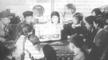

半导体
-------

　　【作者：岳玉宝】

　　在那个年代，几乎人人都穷，而她家则穷得更彻底。诺大的村子，找不到他们的栖居之所，东家住几天，西家住几天，她爹说这是鸽子串房檐。

　　住到我家对面时，她已出落成一个美丽的少女，人们见了都说，这妮子长得真俊，多像铁梅呀。

　　她爹总是叹息一声，俊有啥用呢，一个女娃子。

　　她爹只有她一个女儿，在村里没有劳力，没有个儿，这后半生，该托付给谁呢？

　　她爹是个果树好手，人们都叫他老林业。老林业的手每年不知要抚弄出多少果子，却无法换成一分钱，穷得连自己的房子都没有，对女儿就自有一段心事。

　　可她却不知世道的艰难。女儿家因为自己的美丽更有些对美好生活的想法。人们说她像铁梅，她自己觉得更像那个演铁梅的，整天哼提篮小卖，哼穷人的孩子早当家。房东家买一台半导体，她一见就喜欢得了不得。半导体中传出的那个世界，正是她所希望的生活呀。她整天歪在人家家里，小小的黑匣子成了她通往梦想的唯一途径。因此，她不管人家的脸色，忍了人家的指槐骂桑。

　　终于房东受不了了，提出让她家搬家。

　　她爹一咬牙，搭茅草棚，也要有间自己的房。

　　她却听不到半导体了，她不管她爹如何恼怒，坚持提出要买一部半导体，她爹狠狠地给了她一巴掌。

　　我忘不了她的嚎啕大哭，那么大的人哭得比孩子还孩子。也许她觉得她太有理由哭了，她从不奢望什么，甚至舍不得买一条别的姑娘都有的长围脖，那对一个美丽的女孩该是多大的诱惑。

　　可是她却不去看看她的爹，那倔强、要强的老汉被生活逼得已经走投无路。

　　听不到半导体的她变得沉默起来，乔迁之喜也没能唤醒她的快乐。那是一座土坯的房子，屋里屋外全是黄色的泥巴。

　　终于她有了让她快乐的东西，那是一个英俊的退伍兵带给她的，姑娘的嘴又开始哼哼起了歌。

　　她的爹却不愿意，退伍兵家境一般，又不是个务农干活的料儿，他可指望着个好女婿帮衬呢。可看到女儿欢天喜地的样子，他嘴张了又张，终于咽了回去。

　　可事情却并没有顺利下去，谈及婚嫁时，她提出要买一部半导体，可退伍老兵的妈托人捎过来的话，买啥都行，家里那两个老棺材瓤子我家可不管。

　　一切都不用说了，姑娘撕扯着头发又一次嚎啕大哭，她大骂半导体，大骂退伍兵，大骂这个家的穷。

　　可怜的爹娘，从她的诅咒中听出了一丝丝对他们的怨。

　　时间不长，姑娘就出嫁了，嫁给了一个黑不溜秋的半工半农，老实的小伙子知道她的故事，主动提出要买一部半导体，她说，我什么也不要，只要你养我爹娘的老。

　　姑娘觉得她把自己卖了。她一无所有，她能支配的商品只有她的美貌，她的身体。

　　出嫁不久，她的爹就死了，留给她一座没有一块砖的房子，还有债，还有一手“好林业”。

　　再见到她时，我已看不到昔日那个美貌的少女，岁月席卷去她动人的风采，留给她一张粗糙的脸，一副臃肿的身材。

　　现在她承包着两亩果园，凭借自己的手艺，一年可收入两万余元。她领着我去看她家的老房子，房子早已塌成一堆，可她说这个也可以卖因为在村子中心的地带，有好多人想买。她说我爹真了不起。穷，不是他的过错，在那个无法流通的年代，捧着金碗也得讨饭吃。

　　本以为她家里一定要买一台高档的音响，那个是她少女时全部的梦，可却没有。

　　她说，要那干啥呢，有钱我倒愿意多盖些房子。

　　她是真正长大成人了。秉袭了她爹的全部性格，倔强和志气。

　　【源自：商品的故事】

