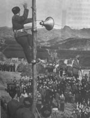

另类
-----

　　【作者：赵刚】

　　1969年，正处于文革期间，我们家中五口人被分别下放到四个地方。可能是下放到农村的第二个年头，哥哥认识的一个上海知青自己动手装了一台半导体，哥哥花了十七块钱将它买过来送给了远在宿迁的爸爸。

　　收音机是我从兴化带回来的，它有本书大小，外壳是手工做的，里面要装三节一号电池，式样很笨拙，像一块愚蠢的砖头。爸爸所在的那个村子极偏僻，连有线广播都没有，收音机一出现顿时轰动了整个村庄，当地的农民对这个说“官话”的匣子极感新鲜，一没事就往我家跑，随便什么节目都听得津津有味。那时候电台的波段不多，能收到也就是三四个。有中央人民广播电台的一套、二套节目，还有的就是江苏和安徽省的两个，一个是早晨六点半钟的中央人民广播电台有新闻和报纸摘要，另一个是晚上八点半的各地广播电台新闻联播。我那时还小，对于这一类节目内容似懂非懂，但是却喜欢听少儿节目，以及每天半小时的长篇小说等文艺类的节目。在乡村的那几年中，我听过的并且记忆深刻节目有长篇小说《闪闪的红星》、《大刀记》、《万山红遍》等等，“四人帮”垮台的那一阵，还有侯宝林的相声《关公战秦琼》，杨振华的《下棋》以及马季说的那个什么“大裤衩子”之类的也让我们很喜欢。这台半导体为我和爸爸在乡村的生活增添了诸多的乐趣，后来想想也可能是上天对于我们全家无端遭“劫”的一种补偿吧。正自从有了这台半导体后，爸爸的日子就好过了许多，有时队长会派他一些轻活儿，但是却给他记重活的工分，条件就是让爸爸在下地干活时得把半导体带上，以便“歇晌”时能放一段节目给从伙儿听听。

　　十年后文革结束，我们全家重又回到南京，那时候爸爸已经从意志到身体全垮了，数年后去世，那台半导体后来被我妈妈继承了下来。在农村时不觉得，进了城市之后才了现这台半导体的音质特别纯，渗透力极强，而且音量再大，音质也不会溃散、变异，所以尽管它的样子越来越让人觉得土了，妈妈依然不忍将它舍弃。她用它听新闻、听长篇评书与证券信息什么的，走哪儿都要捧着它。哥哥姐姐和我多次劝她另换一台并自作主张前后陆续为她买了两台新机子，期望以一种既成事实方式迫使老人家接受，可这一切的努力在老人家的固执面前统统不堪一击，那两台新机子被母亲无端地挑出许多毛病，什么波段太多，调台过于繁琐啦，什么耗电过快，音质太过粗糙啦，每一条都成为她拒绝使用的理由，以致于两台价格不菲极具科技含量的机子至今仍闲置一旁，并时不时被母亲拿出来向有兴趣的客人们指责一番以突出自己那台老半导体的价值。如果事情仅仅到这一步，她爱用哪能台不爱用哪一台我真没什么好说的，可是后来因为那一台老式半导体使得母亲和我之间也产生了许多矛盾。说到这一点要说到我的工作了。从95年开始，我一直靠写作生活，写作当然是要在家里进行的了，我不可能每天一清早搬一张桌子到人潮汹涌的大街上去写作吧，而每一个作家在工作时可能都受不得任何一点别的声音的打扰，我自然不例外，可问题是我们家有一台特别“另类”的半导体，而那台半导体的声音又特别“入耳”，哪怕隔着房门和墙壁它的声音也呼呼地往我耳朵里钻，天知道那台机子的音质怎么会那么好。为此我和妈妈经常吵架，我不让她听广播，起码是在我工作时不能听，我妈则有一千个理由必须要听，不听不行。

　　算起来这台半导体已经存活近三十年了，看样子起码还能再活三十年。也奇怪三十年前的一件“手工”制品怎么就没有一点质量问题？

　　【源自：商品的故事】

