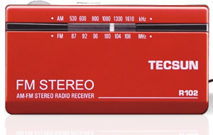

我和收音机的故事
-----------------

　　【作者：周扬】

　　在我3岁的时候，那是1987年。爸爸买回了一台台式卡带机，上面还内置一个收音机，当时父亲每天晚上都用他收听新闻，音质很好，能收听很多电台，还有好多国外的，当时很小我听不懂广播里面说什么所以我就不用它。

　　大约5岁的时候，第一次自己用收音机听广播，那时侯大约是1989年。当时父亲在乡村工作，我放暑假去他单位了，父亲有台很好的收音机，当时不知道什么牌子，现在想想应该是德生的，当时父亲花了150元购买的，在那个年代这是件很奢侈的贵重品。我当时在接受学前教育，还没上小学。每天到下午4点30之前我都会打开收音机寻找熟悉的声音：“亲爱的小朋友们，小喇叭开始为您广播啦！”就是这样喜欢上听广播，喜欢上听收音机。

　　在我上小学二年级以后，那是1991年了。去了乡下的舅舅家里，由于乡村很贫穷，又是山区，几百户村民家中没有一台电视机，交通也不顺畅。舅舅家算是当地比较富裕了，去县城买年货的时候稍回一台收音机，看起来很大气。长方体的，有电话机那么大。舅舅花了200元购买的，由于当时太小不懂什么波段之类的，只知道每天早上六点舅舅就打开收音机，拿起一个小本子和钢笔，把听到的感兴趣的随时记录下来。

　　后来我大了，大约在初中一年级时伴随我爸爸七年的这台收音机被淘气的我给玩弄坏了，父亲是个很怀旧的人，看的出他很难过。但他并没有责怪我。父亲很爱听广播，但是因为家里经济很拮据并没有再去购买收音机。我心理很愧疚，很多次跑到商场里看各式各样的收音机，想自己攒下钱来购买一台新的送给爸爸。终于看到了一模一样的那一款，但是要140元，当时我积攒的所有的钱还不到20元，就这样到了最后也没有买成。家里最早的那台带收音功能的卡带机也被我弄坏了，就这样父亲就再没有听广播。

　　我初中三年级的时候，也就是98年了，我的一个舅舅因病双目失明了，我们都很难过，我爸爸说给他送一台收音机让他听吧，不然他会很寂寞。我和爸爸妈妈就来到最大的一个商场，选了一台88元的购买了下来。当时家里很贫穷，父亲自己都没舍得购买一台用。第二天就专程赶到舅舅家，我亲手递给了他。

　　到了高中三年级下学期，也就是2002年了，因为学习的原因我去了武汉进行一个月的培训，在这期间我在街头购买了一款“福生“的收音机，只有AM中波。但是很便宜只有10元钱，当时很怀疑10元钱买的是不是很差，晚上躺在床上试试，结果信号很好，噪音也很小，耳机音质也好。就这样，这款10元的福生AM单波段的收音机就成为了我自己的第一款收音机。

　　转眼高中毕业了，要去北京念大学，走的时候忘记携带我的第一个收音机了，去了学校，第一天要办理很多事情。到第二天就购买了一台“凯龙“收音机，AM中波和FM调频两个波段，可插耳机也带外音播放，还有抽拉式伸缩天线。听的最多的就是北京音乐台FM97。4 每天都能听到郑阳，伍州同两位主播的声音，多少个不眠之夜都是他们的声音陪伴着我，让漫长的黑夜不再寂寞。。。特别是2003年北京的春季，白色恐怖席卷京城，SAS非典肆虐，为了预防被感染我们都尽量不外出，这时候收音机的作用至关重要，让封闭的空间不再孤寂，通过电波听着熟悉的声音，多少给我们恐慌的心一点点安慰。

　　后来这款凯龙收音机被宿舍兄弟要走了，到了大学二年级下学期，我又购买了我的第三台收音机，当时我想，这是第三次购买了。就买一台稍稍好点的吧，价格在150元以内都行。当时看了种类繁多的收音机品牌型号，真不知道该买哪一个。全波段的，袖珍的，各式各样的都有。买全波段的吗?我思索着，不需要，因为我英语并不好，听不懂外文。而且也不出差就在本地。那么有AM中波和FM调频两波段收音机就可以满足我了。另外我喜欢听音乐所以耳机一定要好点，所以一定要选立体声耳机的。还有我都是晚上听，不能影响他人休息，所以不带外音也可以。当然我出去玩的时候，走路，骑车都喜欢听，所以一定要是便于携带的袖珍机型。当然年轻人使用外型当然要好看了。按照我的要求找了找。看到了一款SONY的收音机380元，只有两节并列的7号电池那么大，很符合我的要求，但是价格确实太贵了，另外是日本货，买他就赞助了日本政府一部分钱，怎么对得起抗日牺牲的英灵呢?得了支持国产吧，看着德生，安键，凯龙，福生几个国产品牌犹豫，凯龙买过了。所以想换个，福生也买过了，也暂不考虑。就剩德生和安键了。好想从小到大，德生的品牌一直是国内的老大，就选他了。一走近德生的柜台一眼就看上德生R102袖珍式收音机了，有银色，蓝色，红色三种颜色，外型也很漂亮。耳机是伸缩式立体声的，有调频FM，中波AM两个最常用的波段，当时就以128元购买下来了。从这以后天天爱不释手，听的最多的除了FM97.4北京音乐台以外又增加了一个FM103.9北京交通音乐台。其他的听的都不多。

　　在我听了一个星期之后，我觉得效果很好，很满意。我就又去购买了一台德生R102，送给我心爱的女朋友让她听。

　　不过在去年我的德生R102收音机被朋友弄坏了，也没去修就一直放在家里。

　　现在我已经毕业开始工作了，一个月前又购买了收音机，呵呵！还是德生R102，价格也还是128元，和两年前一样。两年以后仍然买它了，不过有点遗憾我住的地方信号太弱，没办法半个月钱又买了一台德生R308高灵敏度收音机，总算能在住的地方听到广播了。就这样我现在有两台收音机，一台大的台式德生R308放在家里听，一台袖珍的德生R102出去玩的时候听。

　　尽管我的房间有电脑可以上网，网上也有很多非常好的收音机软件，比如龙卷风网络收音机软件，但是我还是喜欢真正的收音机，我要的那种感觉是收音机软件不能满足的。

　　这就是我一个收音机爱好者，一个广播爱好者与收音机的故事，你们呢?一定也有你们的故事吧，那就让大家也分享一下吧^_^

　　稿件来源：http://blog.sina.com.cn/fmzhouyang

