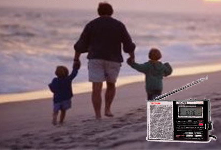

收音机、父亲和我
-----------------

　　作 者：Dyfroyal

　　“When I was young I'd listen to the radio , Waiting for my favorite songs…”Carpenter舒缓、忧伤的歌声伴着咖啡淡淡的香味，在冬日夜晚的房间里轻轻的飘荡、回旋，房间里的暖气将这个北方的夜晚烘托的让人更加慵懒，我静静地斜倚在高高的靠背椅里，闭上双眼懒懒地听着收音机里音乐调频播放的一首首经典的欧美音乐，思绪随着音乐不断的飞扬，飞扬……

　　“小朋友，小喇叭开始广播啦，嘀嘀哒，嘀嘀哒……孙猴子抡起了金箍棒……”孙敬修老爷爷的声音好像依然在耳边讲述着孙猴子的故事，那是七十年代那个不知道天高地厚的夏日的午后，我爬上了家里“高高的”书桌，打开了那台神奇的会发出声音的“木盒子”，小喇叭的声音于是就给我无忧无虑的童年增加了更多欢乐的时光。在外地工作的爸爸说这是收音机，我知道，爸爸在他的工作单位也有一台比家里这台小很多的套着皮套的收音机，听爸爸说还能收到外国台，是爸爸攒了一年的钱才买到的，那时人们好像都叫它“半导体”。

　　上学以后，我从收音机里知道了评书“岳飞传”，我记得那时候，那个节目几乎家喻户晓，大人小孩都爱听。每天早上一上学，我们小朋友就聚在一起，讨论岳飞（后来是岳雷）的“八宝驼铃枪”，一个个口若悬河，仿佛自己就是刘兰芳一样。我还记得课间十分钟还可以听一会儿岳飞传，好多同学就利用这段时间围在老师的宿舍门口，听老师的收音机里精彩的评书，上课铃声响起，老师将收音机关掉，大家才恋恋不舍的回到教室，或许思绪还停留在岳雷的身上……

　　九十年代初，我毕业分配到一家地处黄海之滨的军工单位，是爸爸陪我一起来的，他给我安排好了一切，还给我留了一些钱，说没事的话就买台收音机听吧。

　　在那个偏僻的山脚下，娱乐生活非常单调，是收音机陪伴我度过了三年寂寞的时光。记得那时我买了一台迪桑钟控MW/SW收音机，我经常用它听中央人民广播电台的“今晚八点半”、台湾的中广流行网等，在那里我第一次听到了那首追忆似水流年的《yesterday once more》，还有周华键的《让我欢喜让我忧》以及广播连续剧《刑警803》等。

　　北方的冬夜异常的寒冷，我就这么躺在暖暖的被窝里，枕边的收音机让我始终感觉到一份心灵的恬静和生活的乐趣！

　　那时，我还订阅了《电子报》，买了一些无线电方面的书（我所学的专业是机械），自学如何维修收音机、录音机，我将此事告诉父亲，父亲来信肯定了我的好学和上进，高兴地说：很好。

　　在其中的一本书中，我知道了有一种能数字调谐的收音机，图片好像是索尼的，价格是一千多港元，这使我大开眼界，知道了收音机还能用数字显示频率，能象电视一样自动调谐，也知道了竟然有这么贵的收音机！

　　如今，传媒的多样化使收音机曾经的辉煌逐渐日薄西山，但是我对它的喜爱却依然没有改变，我买的收音机有十几部了（不算带收音机功能的WALKMAN），现在能记起的牌子有：咏梅、迪桑、德生、德劲等，其中德生用的最多，用过的有R909、PL737、757A、550，大概是因为它的市场占有量大吧。

　　记得1997年到北京培训，和我同住一房间的学员带了台收音机，我一看，这不就是几年前我从那本电子学书籍上看到的数字调谐收音机吗？艳羡中我下了决心，当晚就乘地铁来到西单商场，花350元（好像是）买了一部数字调谐收音机，它叫德生PL737。回到宾馆，已是十点多了，我打开收音机，开始我人生的第一次“自动搜索”：北京的音乐调频正在播放老狼的《同桌的你》，清亮的吉他声回荡在初夏的夜晚，我感觉到一种从来所没有体验过的玩机乐趣！

　　还有很多让我难以忘怀的收音机，可我却从来没有想过收藏，有的让我拆坏了，有的送人了，有的卖了，有的换机了，手边听的始终只有一部，因为收音机毕竟是用来听的。

　　如今，经常看到一些朋友给自己的父亲买收音机，却发觉恍然间父亲去世已经15年了。小时候，喜欢听收音机的父亲给了我很多这方面的知识，让我喜欢上了它。我多想父亲现在还活着，给他送一台数字调谐收音机，让他体会和感受科技的进步和儿子的孝心。然而“树欲静而风不止，子欲养而亲不在”的遗憾使我只能在心里默默的祈祷：愿天堂里纯净的音乐能永远伴随在父亲的身边！

　　“……Every shalala every wo'wo still shines.Every shing-a-ling-a-ling that they're starting to sing so fine……”咖啡的热气在袅袅上升的过程中慢慢的消散，我在Carpenter逐渐远去的声音中睁开了眼睛。我想今年春节我一定回家，给妈妈捶捶背、揉揉肩，以尽儿女之孝，顺便把父亲的那台三波段（MW/SW1/SW2）半导体收音机带回家来留做纪念！

