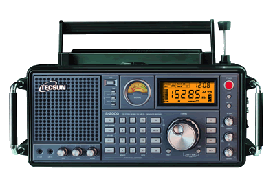
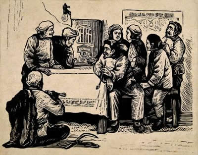

德生S2000收音机，我的情与痛
------------------------------

　　作者：马纪伟（黑龙江）

　　2007年，《电子世界》杂志的封面刊登了德生S2000收音机的照片，看到这台收音机，我马上就喜欢上了，虽不知道性能如何，但其大方的外观，精致的做工，简直太完美了。

　　2008年10月，我在收音机论坛上给德生服务部的侯传发了一封短信，表达了想要购买一台S2000的愿望，侯传当天就给予了答复，服务之快捷令人叫好。汇款15天后，收到了包装完好的收音机，检查包装箱有空运的封条。

　　我是一名下岗工人，现在靠打工生活，收入不是很高，为了一台心爱的收音机，我省吃俭用了10个月，兜里存下了400元。今年某工程施工遇到了问题，请我去帮忙，忙了三天问题解决了，工地领导请喝酒后给我1000元作为答谢，本来不想收，但一想到S2000，还是违心的收下了。

　　收音机打开后，接收当地调频节目，音质非常好，心里别提多高兴了。这可能是我这个老收音机爱好者的最后一台收音机了吧，因为自己快到花甲之年了。

　　老伴看到家里多年没添啥大件了，见我突然买回一台收音机，便问花了多少钱？我告诉老伴：“不贵，才400元。”老伴说：“还不贵啊，我买一件100元的衣服你都舍不得。”嘟囔、埋怨全来了。我很理解我老伴，我们在一起生活30多年了，没有给妻子带来多大的幸福和快乐，自从我下岗后，更是要经常为生活拮据发愁。想想自己用私房钱买台收音机，真是有点过分了，可是一想到一生中对收音机的狂热和执着，还是欲罢不能，深感值得。抚摸着新买的收音机，想起小时候为了装一台矿石收音机所受过的苦，甚感欣慰。

　　记得小学五年级的时候，同学有一本矿石收音机的小册子，我看到后立即被深深吸引，用一块矿石和线圈，加上天线就能收到广播，这太神秘了！可是，同学只答应借读两天，于是我用这两天的课余时间和晚上点上煤油灯，将这本矿石收音机小册子全部手抄了下来，还照书上的插图画了线路图。

　　家乡是东北一个偏僻的小山村，没有通电，用煤油灯照明。那里根本找不到铁矿石，如果去县城买，得走30公里山路，还不知道有没有，也不知道哪家商店有。

　　好在家乡有个小火车站，经常有一些货车在那里停靠。记得暑假期间，我每天都去车站，到火车厢里看有没有褐色的铁矿石，连续找了20多天，一点发现也没有。就在我失望的时候，车站停了一列车皮，雨后铁矿石褐色的粉末从车厢里流出，我一看惊呆了，这不是自己朝思暮想的铁矿石吗？就象哥伦布发现了新大陆一样，高兴极了，马上爬进车厢，一块一块捡起来。小册子上说：“铁矿石上要有晶点，用阳光照射有强烈反光的亮点就是晶点。”就在自己专心寻找带有晶点的矿石的时候，火车鸣笛启动了，我着急爬上车厢想下车时，火车已经加快了速度，当时我还小，火车车厢又那么高，跳车自己也没有胆量，那时才明白啥叫“叫天天不应，叫地地不灵”。后来索性什么也不管了，继续找矿石，没有装的东西，就干脆脱下裤子，将裤腿系上，全都捡起来倒进裤腿里。不知道过了多长时间，火车终于在一个车站停下，跳下车一看，这是哪里呀？

　　只得穿着短裤，扛起沉甸甸的心爱的矿石，顺着火车前进的相反方向，沿着铁路往家走。不知道走了多久，天慢慢黑了，路旁的蚊子好像很久没有吃东西，争先恐后地扑到我身上，汗水已经将装矿石的裤子浸湿了，直到晚上11点才依稀看见家乡暗淡的煤油灯光，进门的时候，全家人都惊呆了……

　　终于有矿石了，按照书上说的，用木块将有晶点的矿石夹住，用缝衣服的针对准晶点固定好，用从农机站捡回来的几段铜线圈缠绕在花椒面盒上并做好抽头，用一支破旧的蛇簧扬音器拆下的漆包线缠绕的磁铁上，找个罐头盖吸在磁铁上作发声板，用煤油灯烧一下漆包线去掉漆皮，小心的接上线并固定好，用电池试一下有咔咔的响声，简易耳机制作成功。

　　室外架起天线，室内砸地一根地线，一切接好了，当拿起耳机听到广播声音的时候，那高兴的，不亚于娶到媳妇的小伙子，天天躺在被窝里听，能听到苏联台和本省的节目。

　　从此，对收音机的热爱就越发不可收拾，从单管收音机到五管超外差收音机，都一路组装下来

　　，其乐无穷。收音机让我从中获得了很多乐趣，知道了很多知识，伴随我度过了激情燃烧的部队生活。

　　劳累了一天后，能静静地躺在东北火炕上听听收音机，会感到无限的轻松和惬意，不仅疲劳很快消除了，还能感到山沟离世界更接近了。

　　现在，终于有了S2000这台高级收音机，多年的愿望实现了，心里的高兴劲真是没得说，电视也不看了，听着喜欢的节目，听着从那遥远的地方传来的声音，就是美啊！

　　然而美景不长，这几天工地施工很忙，领导要求我们加班，多天没有回家。这天因下雨不能施工了，放假我回到家里，第一眼就发现收音机不见了，马上问老伴我的戏匣子（六十年代俺们农村人对收音机的称呼）哪里去了？老伴回答说：“孩子舅舅昨天来了，看到收音机问多少钱买的，我说你姐夫花了400元买的。”

　　小舅子也很喜欢收音机，二话没说从兜里掏出500元，拿走了收音机。老伴拿出钱：“这400元还给你，100元我留下买件换季的衣服。”

　　我接过钱，心里甭说多难过，刚要发脾气，就感到眼前一黑，啥也不知道了。

　　醒过来发现我躺在医院的病床上，老伴正眼泪汪汪的拉着我的手看着我，床头的吊瓶和输液管像一根天线一样连在我的手上。医生说，我的血压很高，不要乱动，要静静休息。

　　我的血压一向很正常，这次却高出了许多。第二天大夫检查，血压还是不降，医生问我是不是受了打击，血压怎么会突然升高？我真是一言难尽啊。

　　趁老伴准备饭的时间，我向大夫坦白交代了我为啥会血压升高的经过，大夫听了后笑着说了句“你等一下”就出去了，一会就抱了台S2000回来，放在床头，打开电源，又听到调频节目了。原来这位哈医大毕业的大夫，也是收音机爱好者，他的S2000比我早买20天。

　　可能是治疗的效果，也可能是看到了S2000的关系，我的血压恢复了正常，大夫通知我，可以出院了，我将收音机还给他，深深地向他鞠了一躬。大夫告诉我，血压高的人，要少看电视，听听收音机能够保持心情平静，血压正常。

　　出院回到家里，看到我放S2000的地方放了一张汇款存根单，我拿起来一看，是老伴给德生汇了款。我高兴得差点把老伴举起来，高喊了一声：“老伴，我爱你！”老伴说：“跟你快一辈子了，还是第一次听到你说这句话。”

　　今天天气非常好，心情也好，邮局来电话通知我去取东莞德生寄来的包裹。我来到小舅子家，给小舅子媳妇300元，骑上他心爱的雅马哈摩托车直奔邮局。

　　收音机，我一生的爱！德生收音机，我们喜欢你！

