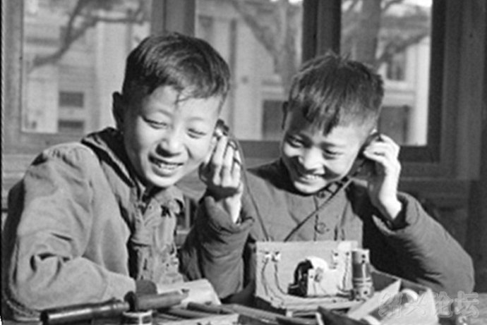

矿石收音机
-------------------------------

　　作者 【付颀】 源自《老付铁道部大院回忆录》2016-09-23

    
　　我爸是个电力工程师，动手能力特别强，家里的很多东西都是他自己动手做的，我或许继承了他的一部分基因，从小也很喜欢自己动手制作一些小玩意。

　　小学时班里有个跟我很要好的同学叫倪振生，外号叫“泥巴儿”，他也喜欢自己动手做东西，放学以后他经常请我到他家一起搞小制作。记得他曾有一个很伟大的设计：自己动手做一台能够自己行走的蒸汽机车，基本原理是用一个旧罐头盒做车头，装上轮子，罐头盒里面装满水，靠罐头盒下面的煤油灯把水烧开，产生的蒸汽向后喷射，推动机车前行。假如这个设想成功了，我俩会对祖国的科学事业做出多么大的贡献啊！可惜我俩忙了很长时间，最后才意识到，靠小小的煤油灯把一罐水烧开是很难的，即便烧开了，那个罐头盒里的蒸汽也根本无法让那辆火车行走，我们的试验最后以失败告终，但这个过程确实锻炼了我们的思考能力和动手能力。

　　后来我在爸爸的书架上看到几本无线电杂志，里边有一篇自制矿石收音机的文章，我非常感兴趣，就又开始迷恋起做矿石收音机了。

　　根据杂志文章的提示，我开始筹备零件。爸爸床底下有一个旧木箱，里边装的都是些旧的电器零件，我就翻箱倒柜的找，找到了耳机、可变电容、电阻器、漆包线等等。有些零件爸爸的箱子里没有，如代替矿石起检波作用的晶体二极管（在城市里根本找不到那种矿石的），好在那东西并不算太贵，我向妈妈要了三毛钱，舍不得坐车，从会城门走了两个多小时到前门大街，在电器商店买了一个处理的晶体二极管回来。线圈是我自己用漆包线在纸筒上一圈一圈缠的，怕漆包线脱落，缠好之后，再用蜡烛在上边滴了一层蜡，起固定作用。忙了好几天，所需的零件基本就凑齐了。

　　我找了一块小木板当底座，按照线路图，把零件一个一个地连接起来，用电烙铁焊住，组装程序就完成了，我怀着激动的心情戴上耳机，奇怪！竟然一点声音也没有。什么地方出了问题？我照着线路图查了一遍，好像没什么问题啊。又查了一遍，噢，我还没有装天线和地线呀！

　　我把一根电线固定在小竹竿上，插在我家后窗户外边当天线，再把一根电线缠在厨房自来水管子上当地线，连接好之后，又赶紧戴上耳机试听，还是一点声音也没有。心里真是沮丧极了！

　　晚上爸爸下班回来，我请他帮我检查一下，他只是用眼角在我的电路板上扫了一眼，说了句“电阻装反了”，就回房间忙他的去了。专家就是专家，在老爸这个电力工程师眼里，我这个小小的矿石收音机就是“八大金刚吃豆芽——小菜一盘”啊！

　　经过反复试验，我的矿石收音机终于制作成功了！不但有了声音，竟然可以收听到中央人民广播电台等三个电台的节目呢！最重要的一点是：矿石收音机不用电池，用现在的话说，就是“绿色电器”，天天开着也不费一度电，这对于我们这些穷孩子来说是多么美的一件事啊。

　　那个矿石收音机是我的宝贝，每天放学回来都要戴上耳机听一会儿，那时候最爱听的是“小喇叭”节目，有孙敬修老爷爷讲故事，还有好听的儿童歌曲。还有一个“小朋友信箱”节目我特别喜欢，专门回答小朋友提出的问题。我还记得那个节目开始时有一个小木偶在唱：

　　我是小叮当，

　　工作特别忙，

　　小朋友来信我都管，

　　我给小朋友们开信箱。

　　叮当叮当叮叮当，

　　我给小朋友们开——信——箱！

　　每天睡觉之前，我会把心爱的矿石收音机放在枕旁，在音乐声中入睡。

　　有一天半夜我起来上厕所，觉得耳机里似乎有声音，拿起来一听，是一首从来没有听过的进行曲，挺雄壮的，然后耳机里传出一个发音不大标准的男声：

　　“这里是莫斯科广播电台，这里是莫斯科广播电台，中国的听众朋友们你们好……”

　　我顿时吓坏了！我的妈呀！这是苏联的对华广播啊，这是偷听敌台啊！

　　那时候我虽然小，但也知道“偷听敌台”是很严重的事情。当时似乎全世界大部分国家都是中国的敌对国——美帝国主义、苏联修正主义、各国反动派……我们那时把他们简称为“帝修反”，都是我们的敌人，是一定要打到的！友好国家只有朝鲜、越南、阿尔巴尼亚等寥寥几个。“苏修”同“美帝”一样，是我们的主要敌人。听老师说，苏修亡我之心不死，在边境上陈兵百万，他们的轰炸机只需7分钟就可飞临北京上空，让我们觉得“苏修”比“美帝”更危险、更可怕。如果有人知道了我的收音机能够听到“苏修”的广播，那意味着什么？说不定会被抓起来进监狱的！我几乎不敢想象，决定天一亮就赶紧把这个矿石收音机拆掉。

　　但是到了第二天，我捧着心爱的收音机又舍不得了。而且强烈的好奇心促使我想再听一次“苏修的广播”，听听他们到底说些什么。于是第二天晚上，我故意很晚才睡，夜深人静的时候，悄悄地扭动收音机的旋钮，寻找那个陌生的声音。那个电台像是会捉迷藏一样，时有时无，有时声音清楚得像是在北京发出的，有时候却嘈杂得什么也听不出来。后来我才知道，那是因为有干扰。对付“敌台”，我们广播电台采用的办法是：建立强大的干扰台，针对对方的频率发射巨大的噪音，把他们的节目覆盖掉。我偷偷听了几次，其实所谓“苏修敌台”没什么意思，他们说的事情我都不懂，放的音乐不是苏联的交响乐就是中国的老京剧，我都不大喜欢，以后就懒得听了。

　　有个事我一直搞不明白，我这么一台简陋的矿石收音机，怎么能够收听到远在莫斯科的广播电台？难道我制作的矿石收音机太先进了？哪个线圈偶然多缠了几圈漆包线，所以做出了一个科学上无法解释的奇迹？我或许将来可以成为一个伟大的无线电专家呢。

　　后来才知道，那个电台虽然叫莫斯科广播电台，但并不是真的在遥远的莫斯科，而是布置在中苏边境或是中蒙边境，离北京很近很近的，他们采用大功率的电台对中国进行政治宣传，所以我的小收音机能够收到他的信号也不算什么稀奇事。我想，那时候可能很多同学都收到过苏修的广播，只是他们跟我一样不说罢了。

　　现在科技太发达了，各种各样的多媒体设备可以集中在一个小小的手机上，通过互联网，人们可以在第一时间看到来自世界各个角落的最新信息。现在的孩子已经很难理解“矿石”和“收音机”这两个词汇怎么会联系在一起了。但在我们这一代人的记忆中，矿石收音机给我们童年带来的欢乐和自信，是永远都忘不了的。

　　付颀，男，中国作家协会会员，中国金融作家协会常务副主席,

　　主要作品：长篇小说《影子行长》、《父与子的战争》、长篇报告文学《金融大潮冲浪人》、《舞动的K线图》、《重塑的丰碑》，中篇小说《我爸是行长》、短篇小说《贷款》、《假币》、《收债日记》、《一根筋》、《邻居》等。2012年被中国作家协会、中国文联、全国总工会、文化部等四部委评为“全国优秀文艺工作者”。
