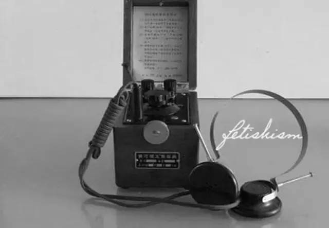
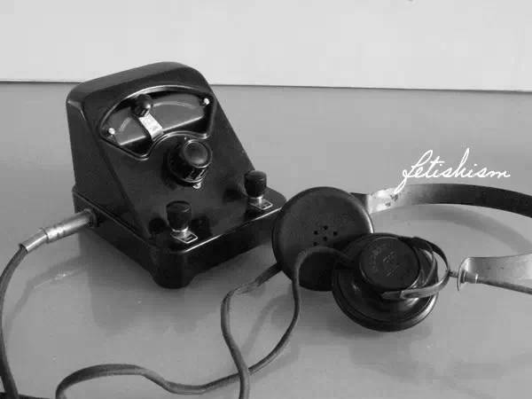
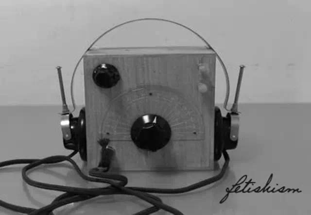
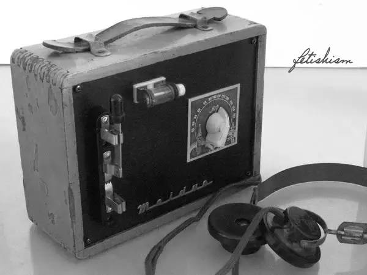
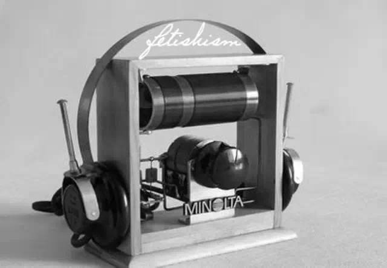

永远的矿石收音机
------------------

　　作者【赵中年】转自：公众号“恋物癖” 2017-07-16

　　闲暇无事翻箱倒柜，找到童年时安装矿石收音机的部分零件，又用现代材料制作了缺失部分。重新戴上古老的耳机，聆听着窃窃私语般的广播声，唤醒了尘封已久的记忆。

　　1962年我12岁，一天上高中的姐姐放学拿回一包东西，我好奇非要打开看看，原来是一套矿石收音机零件，看到一堆好玩的东西别提多高兴了。当时我只认识耳机，在邻居家曾听过耳机里的声音，可其它零件并不认识。姐姐说这是物理课的作业，两个同学一套，装好后可以玩两个礼拜再交回。

　　接下来就是参与姐姐和同学的安装工作，上房架天线理所当然是我的活，当时住的是平房，上下很容易。

　　做天线很简单，找根木棍钉个十字架，又找来细铁丝像蜘蛛网似的绕几圈，把木棍高高的绑在烟筒上，铁丝另一端拉到屋里来就做成了。

　　按照书上说的和线路图上画的把零件连在一起，没有电烙铁，只能把导线和零件用手拧在一块，装好后，我抢着把耳机戴在头上，手捂耳机用劲细听，什么声音也没有。姐姐说我天线架的不对，我说她们把接线错了，反复接了几次还是不响。

　　姐姐失去了耐心去写作业了，把零件扔给了我不管了，我如获至宝，抱着耳机和零件到一边鼓捣去了，放学回来扔下书包就去弄耳机和零件，连作业都没写，两天过去了还没弄响。

　　晚上父亲看我头戴耳机满头大汗闷头鼓捣，随便说了一句话提醒了我：“你把线头刮干净再接上试试啊。”对呀，我忘记了线圈的漆包线外皮是绝缘的，不把漆皮刮掉是不导电的。

　　耳机里终于有了广播的声音，当晚兴奋地听了一宿，夜深了本地的广播电台已停止了广播，但我还是不愿把耳机摘下，听着里面的噪音声电报声，伴随着断断续续的“莫斯科广播电台”的反华广播和听不懂的外语声，我戴着耳机睡着了。

　　第二天高兴的见到同学和小伙伴就吹，我装了个矿石收音机能听广播啦！两个礼拜很快就过去了，我只能恋恋不舍的让姐姐把矿石收音机拿走了。

　　这次安装矿石收音机注定了我一生与无线电结缘，再没有离开。

　　那个年代多数家庭的生活都不富裕，收音机是奢侈品，俗称戏匣子，家中有收音机的也不多，能听到广播是非常快乐的事。我当时幻想着能拥有一台属于自己的矿石收音机，可是家长不可能给一个孩子买零件装矿石收音机玩。

　　我家离电料商店约3公里，坐公共汽车有六站地只需七分钱，因为没有钱只能走一个多小时到商店，爬在柜台上眼巴巴地看着柜台里的耳机，单连，各式线圈，固定矿石，活动矿石......看完依依不舍的走回家，边走边盘算着耳机多少钱，单连多少钱，隔几天再来继续看柜台里的各种零部件。

　　终于下定决心自己攒钱买零件，但家长是不给零花钱的，就只能去拾废铁，捡牙膏皮，当时的牙膏皮是用铅做的，一个能卖三分钱。经过努力手里终于有了几角钱，想着先把便宜的零件买回来再说，买个固定矿石9分钱，再买个便宜的线圈3角多。宇宙牌单连1元5角1分，一幅耳机5元多，不敢想，以后再说，那个年代5元钱够一个人生活半个月了，对于一个孩子5元钱就是一笔巨款。

　　听别人说只要有个耳机和矿石加上天线地线就能收听广播，现在矿石已经有了，耳机呢？太贵了，自己做个耳机试试。

　　姐姐拿回来的耳机我打开看过，里面很简单，一组线圈，一块磁铁，一块铁片就可以了。磁铁家里有，在装钉子的盒子里，上面吸满了钉子，后来才知道那是动圈喇叭上的半块磁铁，砸下来一小块备用，用纸壳做个线圈架，拆个废电器用里面的细漆包线绕线圈，找一小块厚铁片用把破剪子费了好大劲剪成需要的形状做极靴，再找块较平整的薄铁片做震动膜片，用一圆型纸盒做外壳，把磁铁线圈等固定在盒内，接上导线，耳机做成了。

　　我迫不及待地接好天线地线矿石和自制的耳机，拿起耳机细听，用一根针在固定矿石的调整孔内轻轻拨动，欣喜若狂，自己做的耳机竟然有了广播的声音！虽然是几个电台同时广播听不清说的是啥，还是极其兴奋地拿着耳机听着，听着里面发出的细细的混杂的广播声。

　　后来，用自己做的非常漂亮的木头手枪和邻居家的小伙伴换了一个坏的单个耳机，他的爸爸在电话局工作，他有好几个坏的耳机拆磁铁玩。我把它当成宝贝很快修好了，又攒钱买了单连，终于有了完全属于自己的但只有一只耳机的矿石收音机。

　　我家和三姨妈家住在一个大院里，姨妈家房子很宽敞，只有两个女儿，家里有一间套间没人住，这里就是我经常活动的地方，姨妈患病后残疾，腰椎弯曲，腿陂，眼患白内障，信佛吃素为人善良，特别喜欢孩子，我在她家怎么玩闹她都不烦，有时还和我们一起玩。

　　我的矿石收音机都是在姨妈家装的，姨妈家没有收音机，我装好后给她听，她听后还能提出些很专业的建议，竟然知道耳机的阻抗，她把阻抗称作2000号和4000号，并说出哪个号的声音大。

　　原来我的姥姥家过去很富有，家中曾有过矿石收音机，姨妈早在过去就听过。对我制作的耳机加以赞赏，看出我没有钱买耳机才用纸盒制作，当即掏钱让我买全套零件装个矿石收音机给她听。

　　这次再到电料商店不爬柜台了，洋洋得意地掏钱买了全套矿石收音机零件。矿石收音机很快装好了，并做了个漂亮的木盒挂在姨妈家的炕头墙上，白天姨妈没事就戴上耳机收听新闻听戏曲，晚上姨夫躺在炕头上头戴耳机听着听着睡着了......

　　1966年，轰轰烈烈的文化大革命开始了，红卫兵试图批斗姨妈，罪状是她原来是大地主家的阔小姐，证据是家里墙上挂的一张姨妈年轻时穿旗袍烫披肩发的照片，红卫兵说是四旧，应该批判。

　　姨妈的矿石收音机没有白听，而且记意超群，当红卫兵把弯腰，瘸腿的姨妈拉上台时，老人家开始背颂毛主席语录和高呼文革口号把红卫兵搞的哑口无言只好作罢，我装的矿石收音机竟让姨妈躲过了这场劫难。

　　矿石收音机，永远怀念的矿石收音机！
